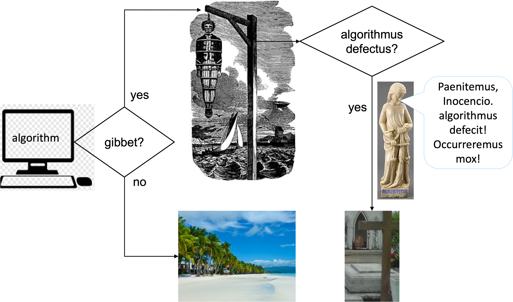

# Ley Algomata (Lex Algomata)

Some people call it **Algorithmic Governance**. I prefer to call it **Lex Algomata** or (**Ley Algomata**) because this term highlights two distinctive features of this emerging technology, namely, automation and risk, as explained in 1 and 2, below. 

In brief, the Lex Algomata, has the potencial to automate 
most of the judicial procedures that are currently executed 
by humans (e.g., lawyers and judges) and mainly
manually (i.e with little or not automation) to enforce 
the law.

 
## Why do I call it Lex Algomata?
1. Ley algomata: in my serious and direct definition _algo_ stands 
   for **algorithm** 
   and _mata_ stands for **automa**. This suggests the use of
   Automata Theory to model algorithms that will help authorities
   (normally represented by lawyers) to enforce the law automatically.
  
 
 2. Ley algomata:  in my more serious and worringly definition, **algo** stands 
    for **something** and **mata** stands for **kill** (all in Spanish 
    language).  It tries to raise concerns that careless automation of law 
    can cause serious problems including death. Let us not forget that
    Computer Technology is not free from failures.  
    
The idea behind the first point is illustrated by the 
Finite State Automata shown in the folloging figure: 

  

 

The idea behind the second point is illustrated by the following 
figure:

  

 

# Corresponding author  
carlos.molina@cl.cam.ac.uk   
Computer Lab, University of Cambridge.
